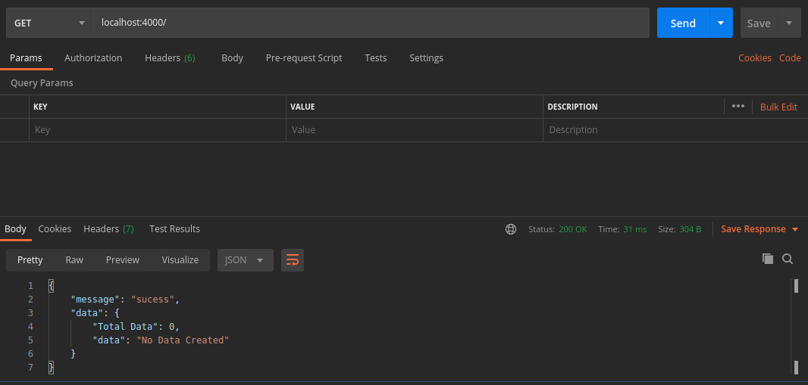
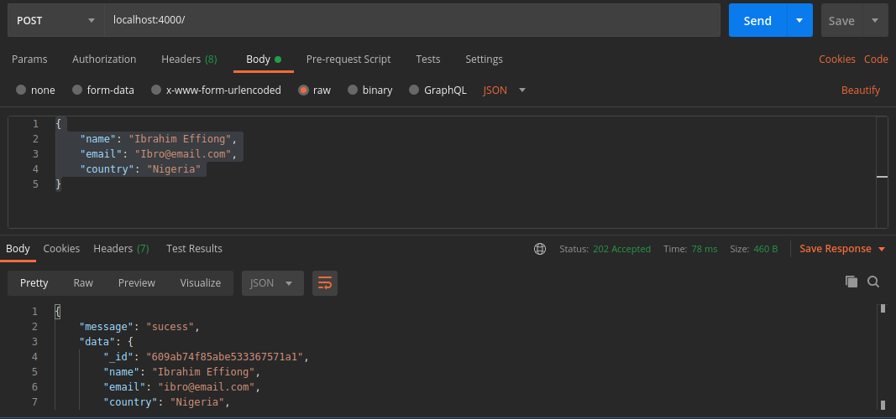
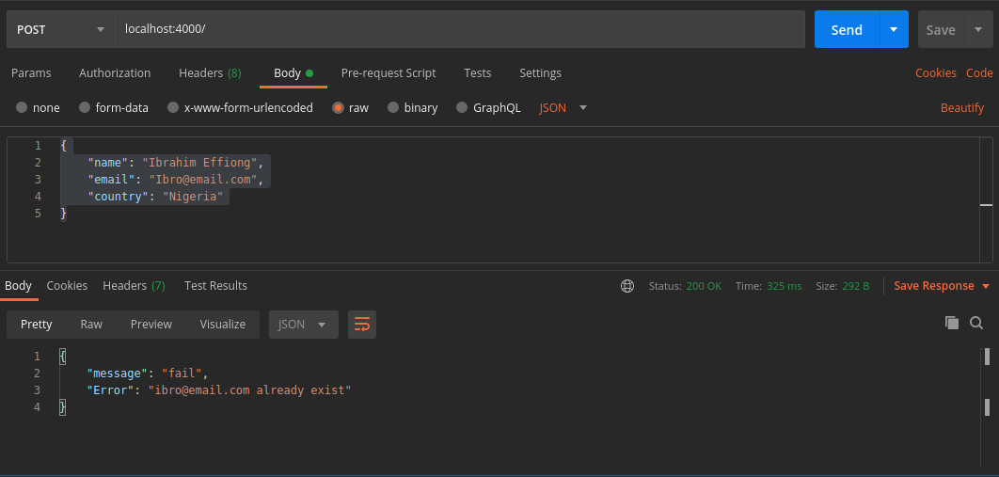
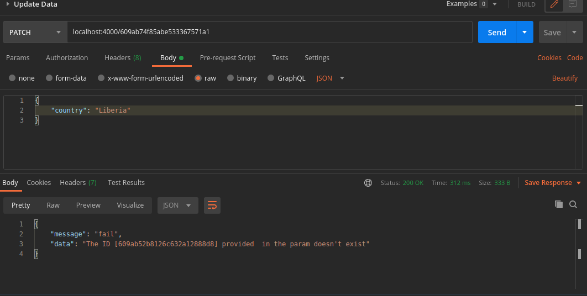
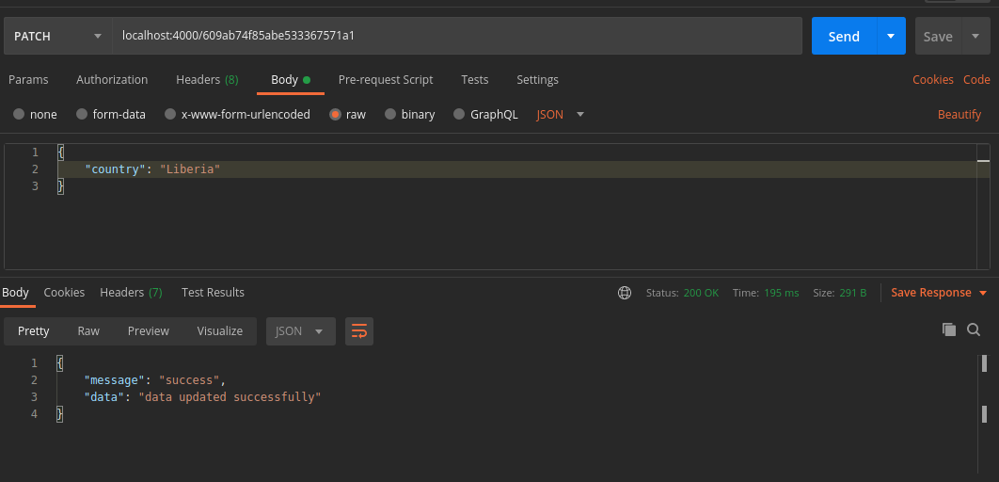
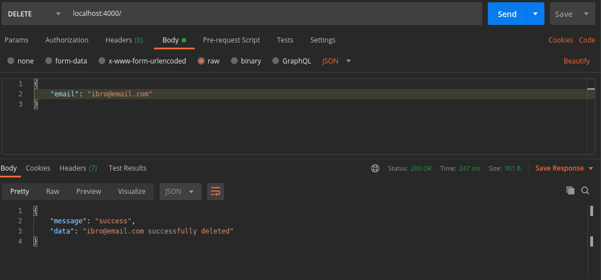
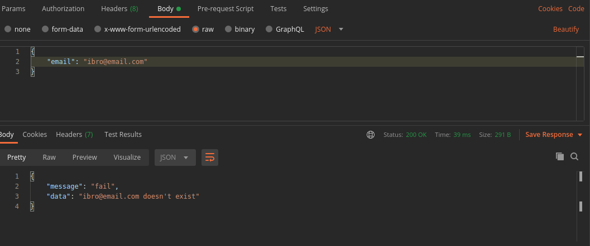

# CURD WITH DATABASE

<br />
<p align="center">
  <a https://training.zuri.team/enrollment>
    
  </a>
</p>

Nodejs is used to create CRUD App That connects to databse.
The following operations can be carried out on the app

- Create Data
- Get's the data created
- Updates the data created
- Deletes the data created

### Built With

- [Nodejs](https://nodejs.org/en/)
- [Expressjs](https://expressjs.com)
- [Monogodb](https://www.mongodb.com/)

<!-- GETTING STARTED -->

## Getting Started

This is an example of how you may give instructions on setting up your project locally.
To get a local copy up and running follow these simple example steps.

### Prerequisites

To use this app in a your local environment, you need to install.

- npm
  ```sh
  npm install npm@latest -g
  ```

### Installation

2. Fork the repo
   ```sh
   git clone https://github.com/udofia2/coding-assessment-test
   ```
3. Install NPM packages
   ```sh
   npm install
   ```
4. Environmental setup
   ```sh
   cp sample.env .env
   ```
5. To start development server
   ```sh
   npm run dev
   ```

## Usage

This project can be tested using postman, insomnia etc.
available routes are

- GET / (List of created data can be fetched through this route)

- POST / (This route is used in creating a new data)

- PATCH / (Created Data can be edited/updated/modified through this route)

- DELET / (Created Data can be deleted from the database through this rute)


_For more examples, please refer to the [Documentation](https://documenter.getpostman.com/view/7592361/TzRU9mg2)_

## Contributing

Contributions are what make the open source community such an amazing place to be learn, inspire, and create. Any contributions you make are **greatly appreciated**.

1. Fork the Project
2. Create your Feature Branch (`git checkout -b feature/AmazingFeature`)
3. Commit your Changes (`git commit -m 'Add some AmazingFeature'`)
4. Push to the Branch (`git push origin feature/AmazingFeature`)
5. Open a Pull Request

## License

Distributed under the MIT License. See `LICENSE` for more information.

## Contact

UDOFIA ABASIODONG - Twitter: [@enalsy2](https://twitter.com/enalsy2) - enalsy22@gmail.com

Heroku hosted link: [https://udofia-crud.herokuapp.com](https://udofia-crud.herokuapp.com)

Project Link: [https://github.com/udofia2/coding-assessment-test](https://github.com/udofia2/coding-assessment-test)

## ScreenShoots








